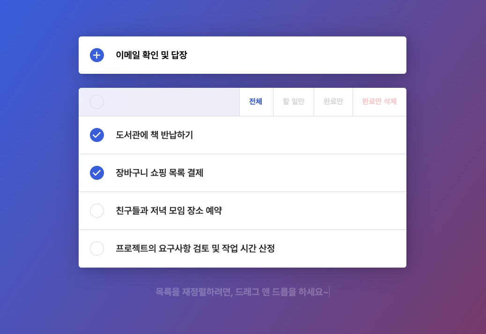
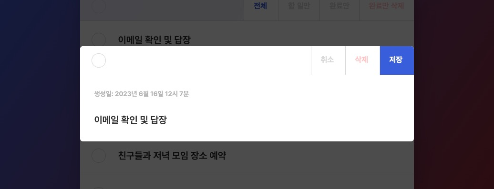

# 📌 할 일(Todo) 관리 앱

주어진 API를 활용해 '[완성 예시](https://todo-vite-vue3-composition-ts.vercel.app/)' 처럼 할 일(Todo) 관리 기능을 구현합니다.  
Vue Composition API + TypeScript를 사용해 구현합니다.

  


## Vue Options vs Composition

- Options API: 강제하는 옵션 사용으로 낮은 진입 장벽 제공, 기존 코드(>=@2)와 호환성 유지
- Composition API: 유연한 구조로 코드 재사용성 향상 가능, 타입스크립트 호환성 향상

## Pinia

https://pinia.vuejs.org/

- Vue.js 핵심 팀 멤버가 개발한 상태 관리 라이브러리
- 공식 Vuex와 유사하지만, 더 간단하고 직관적인 API 제공
- Vue.js 측에서 공식적으로 사용을 추천
- 다음 버전의 공식 Vuex에서 차용하거나 아예 Pinia로 전환 예정

## Vercel 내부 종속성 버전 재정의

타입스크립트를 사용할 때, 직접 설치한 버전과 Vercel(`@vercel/node`) 내부에서 사용하는 버전이 다른 경우 다음과 같이 일치시킬 수 있습니다.  
Vercel 서버리스 함수를 사용할 때, 문제가 발생할 수 있습니다.

/package.json

```json
{
  "devDependencies": {
    "typescript": "^5.0.2",
    "vercel": "^30.2.1"
  },
  "overrides": {
    "@vercel/node": {
      "ts-node": "10.9.1",
      "typescript": "5.0.2"
    }
  }
}
```

## ESLint

/.eslintrc.json

```json
{
  "extends": [
    "eslint:recommended",
    "plugin:@typescript-eslint/recommended",
    "plugin:vue/vue3-recommended",
    "plugin:prettier/recommended"
  ],
  "parserOptions": {
    "parser": "@typescript-eslint/parser"
  }
}
```

- `parser`: ESLint 전반에 걸쳐 사용하는 기본 파서를 설정    
- `parserOptions.parser`: 특정 플러그인(Vue)에서 사용하는 파서를 설정

## API 정보

모든 요청은 다음 Headers 정보가 필수로 포함돼야 합니다.   
`<APIKEY>`와 `<USERNAME>` 정보는 별도 제공합니다.

```curl
curl <ENDPOINT>
  \ -X <METHOD>
  \ -H 'content-type: application/json'
  \ -H 'apikey: <APIKEY>'
  \ -H 'username: <USERNAME>'
```

- '완성 예시'에서는 '할 일 목록 순서 변경' API와 `order` 속성을 사용하지 않았습니다.   


### 할 일 목록 조회

전체 할 일 목록을 조회합니다.

```curl
curl https://asia-northeast3-heropy-api.cloudfunctions.net/api/todos
  \ -X 'GET'
```

__요청 데이터 타입 및 예시:__

- N/A

__응답 데이터 타입 및 예시:__

```ts
type ResponseValue = Todo[] // 할 일 목록

interface Todo {
  id: string // 할 일 ID
  order: number // 할 일 순서
  title: string // 할 일 제목
  done: boolean // 할 일 완료 여부
  createdAt: string // 할 일 생성일
  updatedAt: string // 할 일 수정일
}
```

```json
[
  {
    "id": "mnIwaAPIAE1ayQmqekiR",
    "order": 0,
    "title": "JS 공부하기",
    "done": false,
    "createdAt": "2021-10-28T05:18:51.868Z",
    "updatedAt": "2021-10-28T05:18:51.868Z"
  },
  {
    "id": "tMzPImGoWtRdJ6yyVv2y",
    "order": 1,
    "title": "과제 PullRequest(PR) 생성",
    "done": true,
    "createdAt": "2021-10-28T04:16:53.980Z",
    "updatedAt": "2021-10-28T09:40:17.955Z"
  },
  {
    "id": "Rq8BebKihCgteHHhMIRS",
    "order": 2,
    "title": "API 스터디",
    "done": false,
    "createdAt": "2021-10-28T04:17:02.510Z",
    "updatedAt": "2021-10-28T04:17:02.510Z"
  }
]
```


### 할 일 항목 추가

할 일 항목을 새롭게 추가합니다.

```curl
curl https://asia-northeast3-heropy-api.cloudfunctions.net/api/todos
  \ -X 'POST'
```

__요청 데이터 타입 및 예시:__

```ts
interface RequestBody {
  title: string // 할 일 제목
  order?: number // 할 일 순서
}
```

```json
{
  "title": "KDT 과정 설계 미팅"
}
```

__응답 데이터 타입 및 예시:__

```ts
interface ResponseValue {
  id: string
  order: number
  title: string
  done: boolean
  createdAt: string
  updatedAt: string
}
```

```json
{
  "id": "7P8dOM4voAv8a8cfoeKZ",
  "order": 0,
  "title": "KDT 과정 설계 미팅",
  "done": false,
  "createdAt": "2021-10-29T07:20:02.749Z",
  "updatedAt": "2021-10-29T07:20:02.749Z"
}
```


### 할 일 항목 수정

특정 할 일 항목을 수정합니다.

```curl
curl https://asia-northeast3-heropy-api.cloudfunctions.net/api/todos/:todoId
  \ -X 'PUT'
```

__요청 데이터 타입 및 예시:__

```ts
interface RequestBody {
  title: string // 할 일 제목
  done: boolean // 할 일 완료 여부
  order?: number // 할 일 순서
}
```

```json
{
  "title": "Bootstrap 스타일 추가",
  "done": false
}
```

__응답 데이터 타입 및 예시:__

```json
{
  "id": "7P8dOM4voAv8a8cfoeKZ",
  "title": "Bootstrap 스타일 추가",
  "done": false,
  "order": 2,
  "createdAt": "2021-10-29T07:20:02.749Z",
  "updatedAt": "2021-10-29T07:20:02.749Z"
}
```


### 할 일 항목 삭제

특정 할 일 항목을 삭제합니다.

```curl
curl https://asia-northeast3-heropy-api.cloudfunctions.net/api/todos/:todoId
  \ -X 'DELETE'
```

__요청 데이터 타입 및 예시:__

- N/A

__응답 데이터 타입 및 예시:__

```ts
type ResponseValue = true // 정상 응답
```


### 할 일 항목 일괄 삭제

```curl
curl https://asia-northeast3-heropy-api.cloudfunctions.net/api/todos/deletions
  \ -X 'DELETE'
```

__요청 데이터 타입 및 예시:__

```ts
interface RequestBody {
  todoIds: string[] // 삭제할 할 일 ID 목록
}
```

```json
{
  "todoIds": [
    "mnIwaAPIAE1ayQmqekiR",
    "tMzPImGoWtRdJ6yyVv2y",
    "GHrvr3LaPx1g7y2sNuaC",
    "Rq8BebKihCgteHHhMIRS"
  ]
}
```

__응답 데이터 타입 및 예시:__

```ts
type ResponseValue = true // 정상 응답
```


### 할 일 목록 순서 변경

할 일 목록의 순서를 변경합니다.  

```curl
curl https://asia-northeast3-heropy-api.cloudfunctions.net/api/todos/reorder
  \ -X 'PUT'
```

__요청 데이터 타입 및 예시:__

```ts
interface RequestBody {
  todoIds: string[] // 새롭게 정렬할 할 일 ID 목록
}
```

```json
{
  "todoIds": [
    "mnIwaAPIAE1ayQmqekiR",
    "tMzPImGoWtRdJ6yyVv2y",
    "GHrvr3LaPx1g7y2sNuaC",
    "Rq8BebKihCgteHHhMIRS"
  ]
}
```

__응답 데이터 타입 및 예시:__

```ts
type ResponseValue = true // 정상 응답
```
